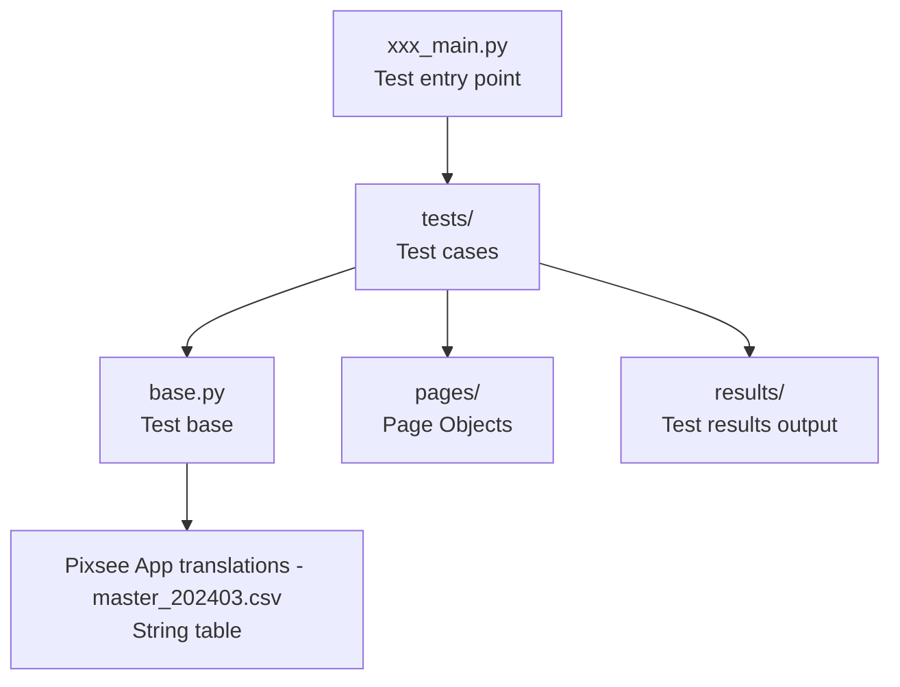

# PIXSEE AUTOMATION

## Getting Started
1. **Clone the project** → Clone this GitHub repo to your local machine.  
2. **Set device name** → Go to `base.py` and modify [`capabilities.device_name = your_device`](https://github.com/PixseeAutomationTest/PIXSEE/blob/dd96d55ca76915b44416ea36aae0819206c093aa/base.py#L24C5-L24C48)  
> [!TIP]
> You can press `Ctrl + R` in PyCharm to search directly.  
   - [x] Use `adb devices` in PowerShell to check your device ID.  
3. **Set account/password** → Go to `base.py` and update [`self.account`](https://github.com/PixseeAutomationTest/PIXSEE/blob/49f028969b8e17daa92fbc708bf81039ee2ea89e/base.py#L192), [`self.password`](https://github.com/PixseeAutomationTest/PIXSEE/blob/5aea4700ed4c3089c599d95bf0392f280d9cee1e/base.py#L194)  
> [!WARNING]
>   - If two devices run at the same time, **they cannot use the same account**.  
4. Open **PyCharm Terminal**.  
5. For the first run, install dependencies:  
   ```bash
   pip install -r requirements.txt
````

6. Make sure there are **⚠️ no red squiggly lines** in your code.
7. Open PowerShell and start Appium:

   ```bash
   appium --use-plugins=inspector --allow-cors
   ```
8. In PyCharm, select the main file you want to execute:

   * `subscription_main.py` → Tests **subscription** (you need to manually subscribe on the phone first).
   * `unsubscription_main.py` → Tests **unsubscription** (make sure the phone has unsubscribed first).
9. Check if the **first test** shows up in PyCharm.

---

## 📖 [Documentation](https://drive.google.com/drive/folders/1aXvqvS8GBj83i1jdijVb5sZESfhnSr2a?usp=drive_link)

---

## 📂 File Overview

### Architecture Diagram



---

### 📁 [`pages/`](pages)

Each page has its own **Page Object**, mainly providing:

* **Click functions** (`click_xxx`)
* **Text retrieval** (`get_xxx_text`)
* **Status checks** (`is_xxx`, `has_xxx`)
* **Advanced actions** (swipe, date selection, delete verification…)

👉 **Here are the grouped features. If you want to implement new ones, you can extend from these:**

#### 🔸 [`album_page.py`](pages/menu_pages/album_pages/album_page.py)

* **Thumbnail operations**

  * `click_recent_thumbnails(count)` → Click multiple recent thumbnails
  * `click_specific_thumbnail(index)` → Click a specific thumbnail by index
  * `delete_and_verify_thumbnail(index)` → Delete a thumbnail and verify it disappeared
* **Date range**

  * `find_thumbnails_between_dates(date)` → Find thumbnails from a target date
  * `find_date_range(date)` → Verify if a date falls in range
  * `count_photos_today()` → Count photos taken today
* **Baby’s birthday**

  * `select_baby_birthday(locale, year, month, day)` → Open calendar and select a date

#### 🔸 [`photo_page.py`](pages/menu_pages/album_pages/photo_page.py)

* **Checks**

  * `is_in_photo_page()` → Verify if you are in a single photo page
  * `find_numbers_in_text(text)` → Extract numbers from a string (e.g., capacity or count)

#### 🔸 [`edit_baby_profile_page.py`](pages/menu_pages/edit_baby_profile_page.py)

* **Basic info**

  * `input_baby_name(new_name)` → Edit baby’s name (avoids duplicates automatically)
  * `select_avatar(number)` → Change profile photo (select from album)
  * `select_baby_birthday(locale, year, month, day)` → Set birthday
* **Selection menus**

  * `select_nation(number=51)` → Select nationality (default Taiwan)
  * `select_relative(number=2)` → Select relation (default Mommy)

#### 🔸 [`pixsee_cloud_page.py`](pages/menu_pages/assistant_pages/pixsee_cloud_page.py)

* **Storage usage parsing**

  * `parse_storage_usage(text)` → Parse "used / total capacity" from text
* **Delete options**

  * `dialog_delete_25_percent_text()` / `50_percent` / `75_percent` / `all_text()` → Get delete option texts
  * `is_dialog_delete_25_percent_clickable()` / `50` / `75` / `all` → Verify delete options are clickable
* **Color & pixel**

  * `photo_color()` / `videos_color()` / `story_color()` / `voice_recorder_color()` → Get coordinates of usage bars
  * `is_pixel_color(x, y)` → Screenshot and check pixel average color

#### 🔸 [`area_detection_page.py`](pages/menu_pages/pixsee_settings_pages/area_detection_page.py)

* **Color detection**

  * `find_stream_left_top()` → Locate top-left of video stream
  * `is_color_in_range(x, y, color_range)` → Check if a pixel falls within a color range

#### 🔸 [`enviroment_settings_page.py`](pages/menu_pages/pixsee_settings_pages/enviroment_settings_page.py)

* **Slider info**

  * `temperature_bar_location()` / `temperature_bar_size()` → Get temperature slider position & size
  * `humidity_bar_location()` / `humidity_bar_size()` → Get humidity slider position & size

---

### 📁 [`tests/`](tests)

* Each test file corresponds to a **testcase**.
* Every test runs in order with:

  * 🛠️ `setUp()` → Executed before each test
  * 🧹 `tearDown()` → Executed after each test
* ⚠️ **Currently cannot verify if images display correctly**

---

### 📁 [`results/`](results)

* Stores test results
* Default filename = **test date** (can be changed)
* Supports **3 languages**

---

### ▶️ `xxx_main.py`

* Test entry point
* You can configure:

  * **Output filename**
  * **Test items / order**
* Currently there are **2 mains**

---

### ⚙️ [`base.py`](base.py)

* All `test.py` files **inherit** from this base class
* Provides:

  * Reduce duplicate code
  * Common utilities (navigate back, swipe, get strings, etc.)

---

### 📑 [`Pixsee App translations - master_202403.csv`](./Pixsee%20App%20translations%20-%20master_202403.csv)

* String table (must be in the same directory as `pages/`, `tests/`, and `results/`)
* Use `base.get_string("ID")` to fetch translations

---

## 🔧 Usage Tips

### 1️⃣ Handling missing IDs with XPath

When an ID cannot be found and XPath differs by language (e.g., Chinese vs English) →
👉 First locate the parent ID, then search for the child element by XPath.

Example (Pixsee Cloud → Free space release option):

```xpath
//android.widget.TextView[@resource-id="com.compal.bioslab.pixsee.pixm01:id/tvPlanDefinition" and @text="Clear 25%, keep about 604.6 MB"]
```

Example screenshot: 

---

### 2️⃣ Code Example

```python
def dialog_delete_25_percent_text(self):
    WebDriverWait(self.driver, 10).until(
        EC.presence_of_element_located(("id", self.ListUpLayer))
    )
    uplayer = self.driver.find_element("id", self.ListUpLayer)
    elements = uplayer.find_elements("xpath", self.List)
    return elements[0].text
```


