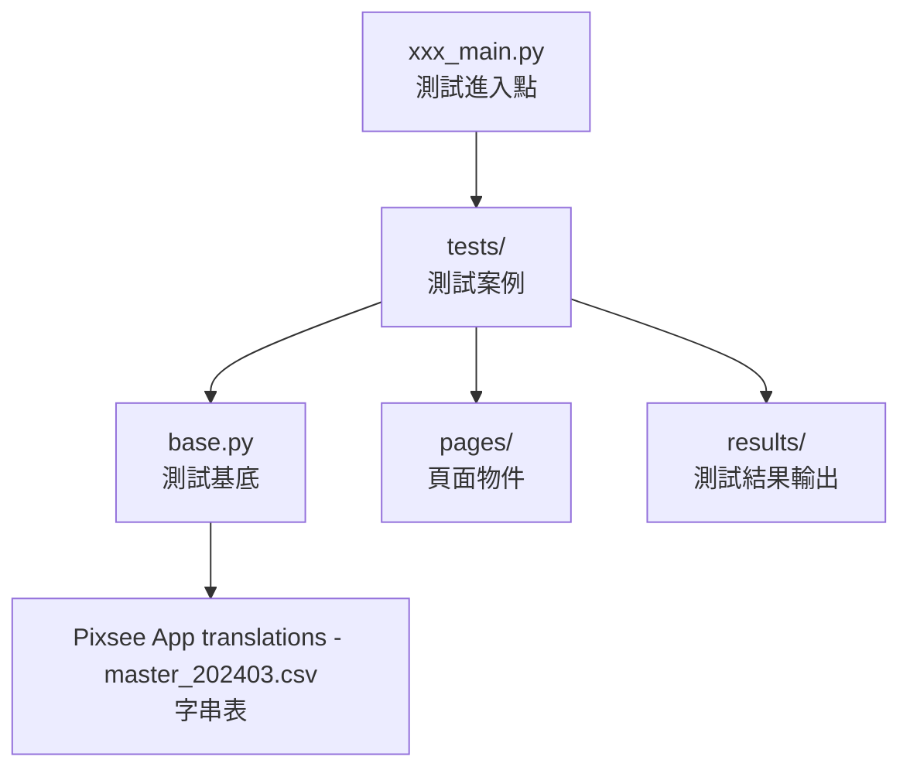

---


# PIXSEE AUTOMATION

## 啟動步驟
1. **Clone 專案** → 把這個 GitHub 連結到自己的電腦  
2. **設定裝置名稱** → 到 `base.py` 改 [`capabilities.device_name = 你的device`](https://github.com/PixseeAutomationTest/PIXSEE/blob/dd96d55ca76915b44416ea36aae0819206c093aa/base.py#L24C5-L24C48)
> [!TIP]
> PYCHARM裡面可以直接crl+r就可以搜尋
   - [ ] 用 `adb devices` 查裝置 ID（在 PowerShell 輸入）  
4. **設定帳號/密碼**  → 到 `base.py` 改 [`self.account`](https://github.com/PixseeAutomationTest/PIXSEE/blob/49f028969b8e17daa92fbc708bf81039ee2ea89e/base.py#L192),[`self.password`](https://github.com/PixseeAutomationTest/PIXSEE/blob/5aea4700ed4c3089c599d95bf0392f280d9cee1e/base.py#L194)
> [!WARNING]
>   - 如果兩台機器同時跑，**不能用同一組帳號**  
5. 打開 **PyCharm Terminal**  
6. 第一次跑的時候輸入：  
   ```bash
   pip install -r requirements.txt
    ```

7. 確認檔案裡面 **沒有紅色波浪線** 
8. 打開 PowerShell，啟動 Appium：

   ```bash
   appium --use-plugins=inspector --allow-cors
   ```
9. 在 PyCharm 選好要執行的檔案並執行：

   *  `subscription_main.py` → 測 **訂閱**（要手動先在手機按訂閱）
   *  `unsubscription_main.py` → 測 **未訂閱**（要確認手機已取消訂閱）
10. 查看 PyCharm 是否有跑出 **第一個 test**


## 📖 [說明文件](https://drive.google.com/drive/folders/1aXvqvS8GBj83i1jdijVb5sZESfhnSr2a?usp=drive_link)

---

## 📂 檔案說明

### 關係圖


---

### 📁 [`pages/`](pages)

每個頁面都有獨立的 **Page Object**，主要提供：

* **點擊功能**（click\_xxx）
* **文字檢查**（get\_xxx\_text）
* **狀態檢查**（is\_xxx, has\_xxx）
* **進階操作**（滑動、日期選取、刪除驗證…）

👉 **以下是各類功能統整，如果有需要寫新功能可以用這些去改：**

#### 🔸 [`album_page.py`](pages/menu_pages/album_pages/album_page.py)

* **縮圖操作**

   `click_recent_thumbnails(count)` → 點選多張最新縮圖
  * `click_specific_thumbnail(index)` → 點選特定索引的縮圖
  * `delete_and_verify_thumbnail(index)` → 刪除縮圖並驗證是否消失
* **日期範圍**

  * `find_thumbnails_between_dates(date)` → 找出目標日期的縮圖
  * `find_date_range(date)` → 檢查日期是否在範圍內
  * `count_photos_today()` → 計算今天有幾張照片
* **寶寶生日**

  * `select_baby_birthday(locale, year, month, day)` → 打開日曆並選日期

#### 🔸 [`photo_page.py`](pages/menu_pages/album_pages/photo_page.py)

* **備註功能**

  * `input_note()` → 輸入備註
  * `get_note_text()` / `note_input_hint()` → 檢查備註文字
  * `get_chart_count()` → 取得字數限制狀態
* **照片操作**

  * `click_trash()` / `click_dialog_delete()` → 刪除照片
  * `click_share()` → 分享
  * `click_download()` → 下載
  * `click_eye()` → 隱藏 / 顯示
* **檢查**

  * `is_in_photo_page()` → 確認是否在單張照片頁面
  * `find_numbers_in_text(text)` → 從字串中抓取數字（例如容量/張數）

#### 🔸 [`edit_baby_profile_page.py`](pages/menu_pages/edit_baby_profile_page.py)

* **基本資訊**

  * `input_baby_name(new_name)` → 修改寶寶名字（自動避免重複）
  * `select_avatar(number)` → 換大頭貼（選擇相簿照片）
  * `select_baby_birthday(locale, year, month, day)` → 設定生日
* **選單操作**

  * `select_nation(number=51)` → 選擇國籍（預設 Taiwan）
  * `select_relative(number=2)` → 選擇關係（預設 Mommy）
* **刪除 / 對話框**

  * `click_delete_baby_profile()` → 按下刪除寶寶資料
  * `get_dialog_title()` / `get_dialog_message()` / `get_dialog_warning_message()` → 取得對話框文字
  * `click_dialog_yes()` / `click_dialog_no()` / `click_dialog_cancel()` → 操作確認對話框
* **檢查**

  * `is_in_edit_baby_profile_page()` → 確認是否在編輯頁
  * `has_calendar()` / `has_selection_list()` / `has_dialog()` → 元素存在檢查

#### 🔸 [`pixsee_cloud_page.py`](pages/menu_pages/cloud_pages/pixsee_cloud_page.py)

* **儲存容量解析**

  * `parse_storage_usage(text)` → 從字串解析出「已用 / 總容量」數值

* **刪除選項**

  * `dialog_delete_25_percent_text()` / `50_percent` / `75_percent` / `all_text()` → 取得刪除比例選項文字
  * `is_dialog_delete_25_percent_clickable()` / `50` / `75` / `all` → 驗證刪除選項是否可點擊

* **顏色與像素**

  * `photo_color()` / `videos_color()` / `story_color()` / `voice_recorder_color()` → 取得儲存指示條中心座標
  * `is_pixel_color(x, y)` → 截圖並檢查指定像素的平均顏色

#### 🔸 [`area_detection_page.py`](pages/menu_pages/detection_pages/area_detection_page.py)

* **教學頁**

  * `is_in_tutor_first_page()` / `is_in_tutor_second_page()` → 確認是否在教學的第一頁 / 第二頁

* **顏色判斷**

  * `find_stream_left_top()` → 找出串流畫面左上座標
  * `is_color_in_range(x, y, color_range)` → 截圖並檢查像素是否在指定顏色範圍內

#### 🔸 [`enviroment_settings_page.py`](pages/menu_pages/settings_pages/enviroment_settings_page.py)

* **滑桿資訊**

  * `temperature_bar_location()` / `temperature_bar_size()` → 取得溫度滑桿位置與大小
  * `humidity_bar_location()` / `humidity_bar_size()` → 取得濕度滑桿位置與大小
---

### 📁 [`tests/`](tests)

* 每個測試檔對應一組 **testcase**
* 所有測試都會依序跑：

  * 🛠️ `setUp()` → 測試開始前執行
  * 🧹 `tearDown()` → 測試結束後執行
* ⚠️ **目前無法檢查圖片是否正確顯示**

---

### 📁 [`results/`](results)

* 存放測試結果
* 預設檔名 = **測試日期**（可自行修改）
* 支援 **3 種語言**

### ▶️ `xxx_main.py`

* 測試進入點
* 可調整：

  * **輸出檔案名稱**
  * **測試項目 / 順序**
* 目前有 **2 個 main**

---

### ⚙️ [`base.py`](base.py)

* 所有 `test.py` **繼承**的核心 class
* 功能：

  * 降低重複 code
  * 提供常用方法（回上一頁、滑動、讀字串表...）
 
---

### 📑 [`Pixsee App translations - master_202403.csv`](./Pixsee%20App%20translations%20-%20master_202403.csv)

* 字串表 (需與 `pages/`、`tests/`、`results/` 同層)
* 常用 `base.get_string("ID")` 來取字串

---

##  功能操作小技巧

### 1️⃣ 找不到 ID，用 XPath 的技巧

當 ID 找不到、但 XPath 包含中英文差異時 →
👉 先找「上層 ID」，再往下找子元素 XPath

範例（Pixsee Cloud → 釋出空間）：

```xpath
//android.widget.TextView[@resource-id="com.compal.bioslab.pixsee.pixm01:id/tvPlanDefinition" and @text="清除25%，保留約604.6 MB"]
```

 範例截圖： 

### 2️⃣ 程式碼示例

```python
def dialog_delete_25_percent_text(self):
    WebDriverWait(self.driver, 10).until(
        EC.presence_of_element_located(("id", self.ListUpLayer))
    )
    uplayer = self.driver.find_element("id", self.ListUpLayer)
    elements = uplayer.find_elements("xpath", self.List)
    return elements[0].text
```


